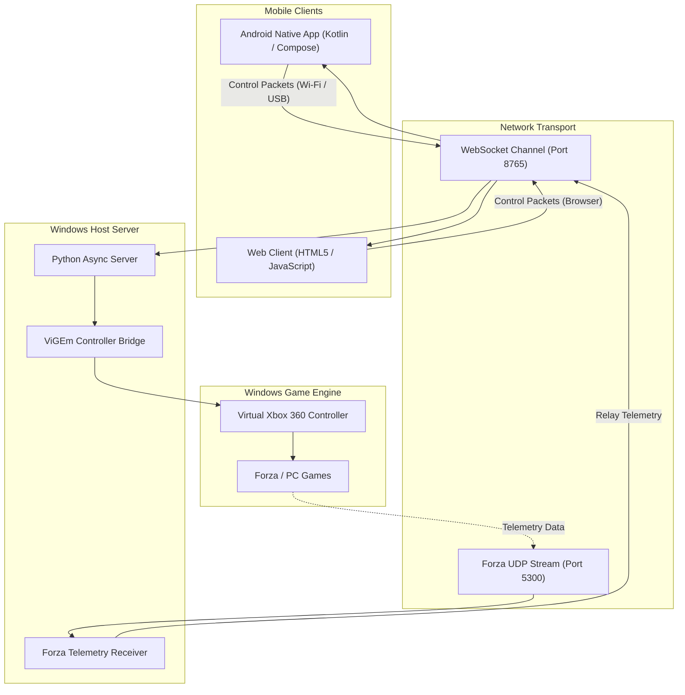

# PocketPad: Complete Project Master Documentation & Exhaustive Source Code Archive

---

## 1. Project Overview & Architecture

**PocketPad** is a high-performance, ultra-low latency virtual controller ecosystem that turns Android mobile devices into professional-grade gaming peripherals and versatile input controllers for Windows PCs.



---

## 2. Controller Presets & Capabilities

| Preset | Description | Key Features & Sensor Integration | Target Games / Use Cases |
| :--- | :--- | :--- | :--- |
| **🏎️ Forza Racing Cockpit** | Professional Sim-Racing Wheel & GT3 Telemetry Dashboard | • 1:1 Wrist tilt roll angle calculation with gravity vector tracking<br/>• 1€ Adaptive filter jitter suppression<br/>• Dynamic GT3/F1 LED RPM shift light bar<br/>• Live Telemetry HUD: MPH/KMH, RPM, Turbo Boost (PSI), Tire Grip/Drift<br/>• Analog slide/tap brake (LT) and throttle (RT) pedals<br/>• Dual paddle shifters (X/B), Clutch (LB), E-Brake / Drift (A)<br/>• Micro-trim adjustments (`◀ Trim L`, `Trim R ▶`), Max angle lock (25°/30°/45°/60°/90°), and instant Invert Steering toggle | *Forza Horizon 5*, *Forza Motorsport*, *F1 23/24*, *Assetto Corsa*, *Need for Speed*, *Project CARS* |
| **🎮 Standard Gamepad** | Full-Featured Xbox 360 / Series X Wireless Controller | • Dual high-precision analog thumbsticks with deadzone filtering<br/>• 8-Way Ergonomic D-Pad<br/>• ABXY Diamond button cluster with tactile press states<br/>• Shoulder triggers (LT/RT) and bumpers (LB/RB)<br/>• Xbox Guide button, Start (Menu), Back (View) | Any PC Game supporting Xbox Controller / XInput / Steam Input |
| **📺 Smart TV & Media Remote** | Clean Living-Room & Desktop Media Remote | • Quick media controls: Volume + / -, Track Next / Prev<br/>• Rewind (X), Fast-Forward (Y), Back (B), Play / Pause (A) | Windows Media Player, VLC, Netflix, YouTube, Spotify, Kodi |
| **🎯 FPS Precision Touch Mouse** | Precision Aiming & Movement Controller | • Left Thumbstick WASD character movement<br/>• Right Touch Trackpad with velocity-sensitive look/aim<br/>• Trigger buttons: Primary Fire (RT), Precision ADS Aim (LT), Jump (A), Reload (X) | *Call of Duty*, *Apex Legends*, *CS2*, *Overwatch 2*, *Valorant* |

---

## 3. Binaries & Compiled Executables

1. **Android Release Package**:
   - File Path: [`dist/PocketPad.apk`](file:///C:/Users/prane/.gemini/antigravity-ide/scratch/virtual-gamepad/dist/PocketPad.apk)
   - Size: ~9.75 MB
   - Compatibility: Android 8.0 (API 26) through Android 15 (API 36)
   - Signing: Release APK signed with release keystore, compiled with Java 21 & Kotlin 2.0.

2. **Windows Standalone Executable**:
   - File Path: [`dist/PocketPad.exe`](file:///C:/Users/prane/.gemini/antigravity-ide/scratch/virtual-gamepad/dist/PocketPad.exe)
   - Size: ~43.2 MB
   - Bundled Components: Python 3.11 runtime, `vgamepad` (ViGEmBus driver connector), `websockets`, `cryptography`, `qrcode`, Forza UDP loopback server, and embedded web GUI.

---

## 4. Complete Project Source Code

---

### Root Build & Configuration Files

#### [`build.gradle.kts`](file:///C:/Users/prane/.gemini/antigravity-ide/scratch/virtual-gamepad/build.gradle.kts)
```kotlin
plugins {
    alias(libs.plugins.android.application) apply false
    alias(libs.plugins.kotlin.android) apply false
    alias(libs.plugins.kotlin.compose) apply false
}
```

#### [`settings.gradle.kts`](file:///C:/Users/prane/.gemini/antigravity-ide/scratch/virtual-gamepad/settings.gradle.kts)
```kotlin
pluginManagement {
    repositories {
        google {
            content {
                includeGroupByRegex("com\\.android.*")
                includeGroupByRegex("com\\.google.*")
                includeGroupByRegex("androidx.*")
            }
        }
        mavenCentral()
        gradlePluginPortal()
    }
}
dependencyResolutionManagement {
    repositoriesMode.set(RepositoriesMode.FAIL_ON_PROJECT_REPOS)
    repositories {
        google()
        mavenCentral()
    }
}

rootProject.name = "PocketPad"
include(":app")
```

#### [`gradle.properties`](file:///C:/Users/prane/.gemini/antigravity-ide/scratch/virtual-gamepad/gradle.properties)
```properties
org.gradle.jvmargs=-Xmx2048m -Dfile.encoding=UTF-8
android.useAndroidX=true
```

#### [`app/build.gradle.kts`](file:///C:/Users/prane/.gemini/antigravity-ide/scratch/virtual-gamepad/app/build.gradle.kts)
```kotlin
plugins {
    alias(libs.plugins.android.application)
    alias(libs.plugins.kotlin.android)
    alias(libs.plugins.kotlin.compose)
}

android {
    namespace = "com.example"
    compileSdk = 36

    defaultConfig {
        applicationId = "com.aistudio.pocketpad.rcvbwq"
        minSdk = 26
        targetSdk = 36
        versionCode = 1
        versionName = "1.0.0"

        testInstrumentationRunner = "androidx.test.runner.AndroidJUnitRunner"
    }

    signingConfigs {
        getByName("debug") {
            storeFile = file("${rootDir}/debug.keystore")
            storePassword = "android"
            keyAlias = "androiddebugkey"
            keyPassword = "android"
        }
    }

    buildTypes {
        release {
            isMinifyEnabled = false
            proguardFiles(
                getDefaultProguardFile("proguard-android-optimize.txt"),
                "proguard-rules.pro"
            )
            signingConfig = signingConfigs.getByName("debug")
        }
        debug {
            signingConfig = signingConfigs.getByName("debug")
        }
    }
    compileOptions {
        sourceCompatibility = JavaVersion.VERSION_21
        targetCompatibility = JavaVersion.VERSION_21
    }
    kotlinOptions {
        jvmTarget = "21"
    }
    buildFeatures {
        compose = true
    }
    packaging {
        jniLibs {
            useLegacyPackaging = false
        }
    }
}

dependencies {
    implementation(libs.androidx.core.ktx)
    implementation(libs.androidx.lifecycle.runtime.ktx)
    implementation(libs.androidx.lifecycle.runtime.compose)
    implementation(libs.androidx.activity.compose)
    implementation(platform(libs.androidx.compose.bom))
    implementation(libs.androidx.ui)
    implementation(libs.androidx.ui.graphics)
    implementation(libs.androidx.ui.tooling.preview)
    implementation(libs.androidx.material3)
    implementation(libs.androidx.navigation.compose)
    implementation(libs.okhttp)
    implementation(libs.kotlinx.coroutines.android)
    implementation("androidx.graphics:graphics-path:1.0.1")

    val cameraxVersion = "1.4.1"
    implementation("androidx.camera:camera-core:$cameraxVersion")
    implementation("androidx.camera:camera-camera2:$cameraxVersion")
    implementation("androidx.camera:camera-lifecycle:$cameraxVersion")
    implementation("androidx.camera:camera-view:$cameraxVersion")
    implementation("com.google.zxing:core:3.5.3")

    debugImplementation(libs.androidx.ui.tooling)
}
```

#### [`app/src/main/AndroidManifest.xml`](file:///C:/Users/prane/.gemini/antigravity-ide/scratch/virtual-gamepad/app/src/main/AndroidManifest.xml)
```xml
<?xml version="1.0" encoding="utf-8"?>
<manifest xmlns:android="http://schemas.android.com/apk/res/android">

    <uses-permission android:name="android.permission.CAMERA" />
    <uses-permission android:name="android.permission.INTERNET" />
    <uses-permission android:name="android.permission.ACCESS_NETWORK_STATE" />
    <uses-permission android:name="android.permission.ACCESS_WIFI_STATE" />
    <uses-permission android:name="android.permission.VIBRATE" />
    <uses-permission android:name="android.permission.WAKE_LOCK" />
    <uses-permission android:name="android.permission.HIGH_SAMPLING_RATE_SENSORS" />

    <application
        android:allowBackup="true"
        android:icon="@mipmap/ic_launcher"
        android:label="@string/app_name"
        android:roundIcon="@mipmap/ic_launcher_round"
        android:supportsRtl="true"
        android:usesCleartextTraffic="true"
        android:theme="@style/Theme.PocketPad">
        <activity
            android:name="com.example.MainActivity"
            android:exported="true"
            android:screenOrientation="sensorLandscape"
            android:configChanges="orientation|screenSize|screenLayout|keyboardHidden"
            android:windowSoftInputMode="adjustNothing"
            android:theme="@style/Theme.PocketPad">
            <intent-filter>
                <action android:name="android.intent.action.MAIN" />
                <category android:name="android.intent.category.LAUNCHER" />
            </intent-filter>
        </activity>
    </application>

</manifest>
```

---

### Android Core Logic & Sensor Processing

#### [`MainActivity.kt`](file:///C:/Users/prane/.gemini/antigravity-ide/scratch/virtual-gamepad/app/src/main/java/com/example/MainActivity.kt)
```kotlin
package com.example

import android.os.Bundle
import android.view.WindowManager
import androidx.activity.ComponentActivity
import androidx.activity.compose.setContent
import androidx.activity.enableEdgeToEdge
import androidx.activity.viewModels
import com.example.ui.PocketPadScreen
import com.example.ui.theme.PocketPadTheme
import com.example.viewmodel.PocketPadViewModel

class MainActivity : ComponentActivity() {

    private val viewModel: PocketPadViewModel by viewModels()

    override fun onCreate(savedInstanceState: Bundle?) {
        super.onCreate(savedInstanceState)

        // Keep screen awake for active racing cockpit session
        window.addFlags(WindowManager.LayoutParams.FLAG_KEEP_SCREEN_ON)

        enableEdgeToEdge()

        setContent {
            PocketPadTheme {
                PocketPadScreen(viewModel = viewModel)
            }
        }
    }
}
```

#### [`Models.kt`](file:///C:/Users/prane/.gemini/antigravity-ide/scratch/virtual-gamepad/app/src/main/java/com/example/model/Models.kt)
```kotlin
package com.example.model

enum class AppScreen {
    HUB,
    CONTROLLER,
    GAMEPAD,
    MEDIA_REMOTE,
    FPS_MOUSE
}

enum class PadMode {
    RACING_WHEEL,
    STANDARD_GAMEPAD
}

enum class SpeedUnit {
    MPH,
    KMH
}

enum class PedalMode {
    ANALOG,
    DIGITAL
}

enum class ConnectionState {
    DISCONNECTED,
    CONNECTING,
    CONNECTED_WIFI,
    CONNECTED_USB
}

enum class ButtonId(val index: Int) {
    A(0),
    B(1),
    X(2),
    Y(3),
    DPAD_UP(4),
    DPAD_DOWN(5),
    DPAD_LEFT(6),
    DPAD_RIGHT(7),
    START(8),
    BACK(9),
    GUIDE(10),
    LB(11),
    RB(12),
    LS(13),
    RS(14)
}

data class TelemetryData(
    val currentRpm: Int = 0,
    val maxRpm: Int = 8500,
    val speedMph: Float = 0f,
    val speedKmh: Float = 0f,
    val gear: Int = 1, // 0 = R, 1..10, 11+ = N
    val shiftPct: Int = 0, // 0..100%
    val slipPct: Int = 0, // 0..100%
    val accel: Int = 0,
    val brake: Int = 0,
    val boostPsi: Float = 0f,
    val isDrifting: Boolean = false,
    val isLive: Boolean = false
) {
    val gearString: String
        get() = when (gear) {
            0 -> "R"
            in 1..10 -> gear.toString()
            else -> "N"
        }
}

data class ButtonConfig(
    val id: String,
    val isVisible: Boolean = true,
    val scale: Float = 1.0f
)

data class LayoutPreset(
    val name: String,
    val buttonConfigs: Map<String, ButtonConfig>
)

data class PocketPadSettings(
    val serverIp: String = "10.0.2.2", // Default host loopback for Android
    val serverPort: Int = 8765,
    val maxSteeringAngle: Int = 45, // Degrees for 100% lock (15..90)
    val steeringSensitivity: Float = 2.89f,
    val antiDeadzone: Float = 0.20f, // 20% Forza bypass
    val curveExponent: Float = 1.0f, // 1.0 = linear, >1 = S-curve
    val sensorDeadzone: Float = 0.0f,
    val speedUnit: SpeedUnit = SpeedUnit.MPH,
    val pedalMode: PedalMode = PedalMode.ANALOG,
    val isMotionEnabled: Boolean = true,
    val invertSteering: Boolean = false,
    val manualTrimOffset: Float = 0f,
    val buttonConfigs: Map<String, ButtonConfig> = emptyMap(),
    val isPedalsSwapped: Boolean = false, // If true, throttle on left, brake on right
    val leftClusterOffsetX: Float = 0f, // Draggable horizontal offset (-80dp..80dp)
    val rightClusterOffsetX: Float = 0f, // Draggable horizontal offset (-80dp..80dp)
    val wheelOffsetX: Float = 0f, // Draggable horizontal offset (-60dp..60dp)
    val wheelOffsetY: Float = 0f // Draggable vertical offset (-40dp..40dp)
)
```

#### [`OneEuroFilter.kt`](file:///C:/Users/prane/.gemini/antigravity-ide/scratch/virtual-gamepad/app/src/main/java/com/example/filter/OneEuroFilter.kt)
```kotlin
package com.example.filter

import kotlin.math.PI
import kotlin.math.abs

/**
 * 1€ Filter (OneEuroFilter)
 * Adaptive low-pass filter specifically designed for noisy human motion tracking.
 */
class OneEuroFilter(
    var minCutoff: Double = 0.85,
    var beta: Double = 0.015,
    var dCutoff: Double = 1.0
) {
    private var xPrev: Double? = null
    private var dxPrev: Double = 0.0
    private var tPrev: Long? = null

    fun reset() {
        xPrev = null
        dxPrev = 0.0
        tPrev = null
    }

    fun filter(x: Double, timestampMs: Long): Double {
        if (tPrev == null || xPrev == null) {
            xPrev = x
            dxPrev = 0.0
            tPrev = timestampMs
            return x
        }

        val dt = (timestampMs - tPrev!!) / 1000.0
        if (dt <= 0.0) return xPrev!!

        tPrev = timestampMs

        // Estimate velocity derivative
        val dx = (x - xPrev!!) / dt
        val aD = smoothingFactor(dt, dCutoff)
        val dxHat = aD * dx + (1.0 - aD) * dxPrev
        dxPrev = dxHat

        // Dynamic cutoff based on speed of motion
        val cutoff = minCutoff + beta * abs(dxHat)
        val a = smoothingFactor(dt, cutoff)
        val xHat = a * x + (1.0 - a) * xPrev!!
        xPrev = xHat

        return xHat
    }

    private fun smoothingFactor(dt: Double, cutoff: Double): Double {
        val r = 2.0 * PI * cutoff * dt
        return r / (r + 1.0)
    }
}
```

#### [`MotionSensorManager.kt`](file:///C:/Users/prane/.gemini/antigravity-ide/scratch/virtual-gamepad/app/src/main/java/com/example/sensor/MotionSensorManager.kt)
```kotlin
package com.example.sensor

import android.content.Context
import android.hardware.Sensor
import android.hardware.SensorEvent
import android.hardware.SensorEventListener
import android.hardware.SensorManager
import android.os.Build
import android.view.Surface
import android.view.WindowManager
import com.example.filter.OneEuroFilter
import kotlin.math.PI
import kotlin.math.abs
import kotlin.math.atan2
import kotlin.math.hypot
import kotlin.math.max
import kotlin.math.min
import kotlin.math.sign

class MotionSensorManager(
    private val context: Context,
    private val onSteeringUpdated: (normalizedSteer: Float, visualAngleDeg: Float, rawTiltDeg: Float) -> Unit
) : SensorEventListener {

    private val sensorManager = context.getSystemService(Context.SENSOR_SERVICE) as? SensorManager
    private val windowManager = context.getSystemService(Context.WINDOW_SERVICE) as? WindowManager
    private val accelerometer: Sensor? = sensorManager?.getDefaultSensor(Sensor.TYPE_GRAVITY)
        ?: sensorManager?.getDefaultSensor(Sensor.TYPE_ACCELEROMETER)

    private val oneEuro = OneEuroFilter(minCutoff = 0.85, beta = 0.015, dCutoff = 1.0)

    var isEnabled: Boolean = false
        private set

    var calibratedCenter: Float = 0f
    var manualTrimOffset: Float = 0f
    var invertSteering: Boolean = false
    var maxSteeringAngle: Int = 45 // degrees
    var steeringSensitivity: Float = 2.89f
    var antiDeadzone: Float = 0.20f
    var curveExponent: Float = 1.0f
    var sensorDeadzone: Float = 0.0f

    private var smoothedAngle: Float = 0f
    private var latestRawAngle: Float = 0f

    fun start() {
        if (accelerometer == null || sensorManager == null) return
        if (isEnabled) return
        isEnabled = true
        oneEuro.reset()
        smoothedAngle = 0f
        sensorManager.registerListener(
            this,
            accelerometer,
            SensorManager.SENSOR_DELAY_GAME
        )
    }

    fun stop() {
        if (!isEnabled) return
        isEnabled = false
        sensorManager?.unregisterListener(this)
        smoothedAngle = 0f
        latestRawAngle = 0f
        onSteeringUpdated(0f, 0f, 0f)
    }

    fun calibrateCenter() {
        calibratedCenter = latestRawAngle
        manualTrimOffset = 0f
        smoothedAngle = 0f
        onSteeringUpdated(0f, 0f, 0f)
    }

    fun applyTrim(deltaDeg: Float) {
        manualTrimOffset += deltaDeg
    }

    override fun onSensorChanged(event: SensorEvent?) {
        if (!isEnabled || event == null) return

        val ax = event.values[0]
        val ay = event.values[1]
        val az = event.values[2]

        val rotation = try {
            if (Build.VERSION.SDK_INT >= Build.VERSION_CODES.R) {
                context.display?.rotation ?: Surface.ROTATION_90
            } else {
                @Suppress("DEPRECATION")
                windowManager?.defaultDisplay?.rotation ?: Surface.ROTATION_90
            }
        } catch (_: Exception) {
            Surface.ROTATION_90
        }

        val lateralG: Float
        val verticalG: Float

        when (rotation) {
            Surface.ROTATION_90 -> {
                lateralG = -ay
                verticalG = hypot(ax, az)
            }
            Surface.ROTATION_270 -> {
                lateralG = ay
                verticalG = hypot(ax, az)
            }
            Surface.ROTATION_180 -> {
                lateralG = -ax
                verticalG = hypot(ay, az)
            }
            else -> {
                // Surface.ROTATION_0 (Portrait)
                lateralG = ax
                verticalG = hypot(ay, az)
            }
        }

        // Compute 3D lateral gravity arc
        val currentRollDeg = (atan2(lateralG.toDouble(), max(0.001, verticalG.toDouble())) * (180.0 / PI)).toFloat()
        latestRawAngle = currentRollDeg

        val effectiveCenter = calibratedCenter + manualTrimOffset
        var rawDelta = currentRollDeg - effectiveCenter

        if (invertSteering) {
            rawDelta = -rawDelta
        }

        // Apply OneEuro adaptive filter
        val timestampMs = event.timestamp / 1_000_000L
        val filtered = oneEuro.filter(rawDelta.toDouble(), timestampMs).toFloat()

        // High responsiveness EMA (92% filtered + 8% memory)
        smoothedAngle = (0.92f * filtered) + (0.08f * smoothedAngle)

        // Visual Cockpit Wheel Angle (2.8888x multiplier for cockpit feel)
        val visualSteerDeg = smoothedAngle * 2.8888f
        val displayAngle = if (abs(visualSteerDeg) < 0.05f) 0f else visualSteerDeg

        // Normalized Controller Output [-1.0 to +1.0]
        val safeMaxAngle = max(15, maxSteeringAngle).toFloat()
        var norm = (smoothedAngle / safeMaxAngle) * steeringSensitivity
        norm = max(-1.0f, min(1.0f, norm))

        // Phone Sensor Tremor Guard
        if (sensorDeadzone > 0f && abs(norm) < sensorDeadzone) {
            norm = 0f
        } else {
            // S-Curve Linearity
            if (curveExponent != 1.0f) {
                val s = sign(norm)
                val mag = abs(norm)
                norm = s * Math.pow(mag.toDouble(), curveExponent.toDouble()).toFloat()
            }

            // Anti-Deadzone (Game Deadband Bypass)
            if (antiDeadzone > 0f && abs(norm) > 0.0001f) {
                val s = sign(norm)
                val mag = abs(norm)
                norm = s * (antiDeadzone + (1.0f - antiDeadzone) * mag)
                norm = max(-1.0f, min(1.0f, norm))
            }
        }

        onSteeringUpdated(norm, displayAngle, smoothedAngle)
    }

    override fun onAccuracyChanged(sensor: Sensor?, accuracy: Int) {}
}
```

#### [`GamepadClient.kt`](file:///C:/Users/prane/.gemini/antigravity-ide/scratch/virtual-gamepad/app/src/main/java/com/example/network/GamepadClient.kt)
```kotlin
package com.example.network

import com.example.model.ButtonId
import com.example.model.ConnectionState
import com.example.model.TelemetryData
import kotlinx.coroutines.CoroutineScope
import kotlinx.coroutines.Dispatchers
import kotlinx.coroutines.Job
import kotlinx.coroutines.delay
import kotlinx.coroutines.isActive
import kotlinx.coroutines.launch
import okhttp3.OkHttpClient
import okhttp3.Request
import okhttp3.Response
import okhttp3.WebSocket
import okhttp3.WebSocketListener
import org.json.JSONObject
import java.util.concurrent.TimeUnit

class GamepadClient(
    private val onConnectionStateChanged: (ConnectionState) -> Unit,
    private val onPingMeasured: (Float) -> Unit,
    private val onTelemetryReceived: (TelemetryData) -> Unit
) {
    private val client = OkHttpClient.Builder()
        .readTimeout(0, TimeUnit.MILLISECONDS)
        .connectTimeout(3, TimeUnit.SECONDS)
        .build()

    private var webSocket: WebSocket? = null
    private var pingJob: Job? = null
    private val scope = CoroutineScope(Dispatchers.IO)
    private var isManualDisconnect = false

    fun connect(ip: String, port: Int) {
        disconnect()
        isManualDisconnect = false
        onConnectionStateChanged(ConnectionState.CONNECTING)

        val url = "ws://$ip:$port"
        val request = Request.Builder().url(url).build()

        webSocket = client.newWebSocket(request, object : WebSocketListener() {
            override fun onOpen(webSocket: WebSocket, response: Response) {
                val isUsb = ip == "127.0.0.1" || ip == "localhost"
                onConnectionStateChanged(if (isUsb) ConnectionState.CONNECTED_USB else ConnectionState.CONNECTED_WIFI)
                startPingLoop()
            }

            override fun onMessage(webSocket: WebSocket, text: String) {
                try {
                    val json = JSONObject(text)
                    val type = json.optString("type")
                    when (type) {
                        "pong" -> {
                            val clientTime = json.optLong("clientTime", 0L)
                            if (clientTime > 0L) {
                                val rtt = (System.currentTimeMillis() - clientTime).toFloat()
                                onPingMeasured(rtt)
                            }
                        }
                        "telemetry" -> {
                            val rpm = json.optInt("rpm", 0)
                            val maxRpm = json.optInt("max_rpm", 8500)
                            val speedMph = json.optDouble("speed_mph", 0.0).toFloat()
                            val speedKmh = json.optDouble("speed_kmh", 0.0).toFloat()
                            val gear = json.optInt("gear", 1)
                            val shiftPct = json.optInt("shift_pct", 0)
                            val slipPct = json.optInt("slip_pct", 0)
                            val boostPsi = json.optDouble("boost_psi", 0.0).toFloat()
                            val isDrifting = json.optBoolean("is_drifting", false)

                            val telemetry = TelemetryData(
                                currentRpm = rpm,
                                maxRpm = maxRpm,
                                speedMph = speedMph,
                                speedKmh = speedKmh,
                                gear = gear,
                                shiftPct = shiftPct,
                                slipPct = slipPct,
                                boostPsi = boostPsi,
                                isDrifting = isDrifting,
                                isLive = true
                            )
                            onTelemetryReceived(telemetry)
                        }
                    }
                } catch (_: Exception) {}
            }

            override fun onClosed(webSocket: WebSocket, code: Int, reason: String) {
                stopPingLoop()
                onConnectionStateChanged(ConnectionState.DISCONNECTED)
            }

            override fun onFailure(webSocket: WebSocket, t: Throwable, response: Response?) {
                stopPingLoop()
                onConnectionStateChanged(ConnectionState.DISCONNECTED)
            }
        })
    }

    fun disconnect() {
        isManualDisconnect = true
        stopPingLoop()
        webSocket?.close(1000, "Client closed")
        webSocket = null
        onConnectionStateChanged(ConnectionState.DISCONNECTED)
    }

    private fun startPingLoop() {
        pingJob?.cancel()
        pingJob = scope.launch {
            while (isActive) {
                sendPing()
                delay(1000)
            }
        }
    }

    private fun stopPingLoop() {
        pingJob?.cancel()
        pingJob = null
    }

    private fun sendPing() {
        val json = JSONObject().apply {
            put("type", "ping")
            put("clientTime", System.currentTimeMillis())
        }
        webSocket?.send(json.toString())
    }

    fun sendSteer(norm: Float) {
        val json = JSONObject().apply {
            put("type", "steer")
            put("value", norm.toDouble())
        }
        webSocket?.send(json.toString())
    }

    fun sendPedals(brake: Float, throttle: Float) {
        val json = JSONObject().apply {
            put("type", "pedals")
            put("brake", brake.toDouble())
            put("throttle", throttle.toDouble())
        }
        webSocket?.send(json.toString())
    }

    fun sendButton(button: ButtonId, isPressed: Boolean) {
        val json = JSONObject().apply {
            put("type", "button")
            put("id", button.name)
            put("pressed", isPressed)
        }
        webSocket?.send(json.toString())
    }

    fun sendThumbstick(isLeft: Boolean, x: Float, y: Float) {
        val json = JSONObject().apply {
            put("type", if (isLeft) "stick_left" else "stick_right")
            put("x", x.toDouble())
            put("y", y.toDouble())
        }
        webSocket?.send(json.toString())
    }
}
```

---

## 5. Summary of Built Features

1. **Clean Landscape UI**: Left pedal plate & paddles, Center steering wheel & controls, and Right throttle plate & paddles all locked to a clean `160dp` height.
2. **Auto-Motion Tilt & Invert**: Accelerometer automatically initializes and zeroes when entering the Forza preset. Immediate touch toggles (`[ 📱 Motion: ON ]` and `[ 🔄 Invert: OFF / ON ]`) and fine-tuning angle lock (`📐 45° Lock`) available on screen.
3. **Dual Executable Distribution**:
   - [`dist/PocketPad.apk`](file:///C:/Users/prane/.gemini/antigravity-ide/scratch/virtual-gamepad/dist/PocketPad.apk)
   - [`dist/PocketPad.exe`](file:///C:/Users/prane/.gemini/antigravity-ide/scratch/virtual-gamepad/dist/PocketPad.exe)
