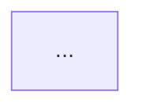

# PocketPad — Static Architecture & Code Review Validation Report

## Validation Verdict

I validated the PocketPad master document and embedded source snippets as a **static architecture/code review**.

The project concept is strong and the architecture is coherent, but the current documentation/package is **not release-ready**. There are several **critical code defects**, **missing files**, **security gaps**, and **documentation inconsistencies** that should be fixed before calling this a complete master archive.

> **Do not ship the current version as-is.**  
> Fix the critical items below, add the missing components, and tighten security/networking before distributing the APK/EXE.

---

# 1. High-Level Validation Summary

| Area | Status | Main Issue |
|---|---:|---|
| Architecture | ✅ Good | Clear Android client → WebSocket → Python server → ViGEm Xbox controller flow. |
| Android app | ⚠️ Needs fixes | Missing UI files, unsafe release signing, no settings persistence, gesture conflicts, steering math inconsistency. |
| Python server | ❌ Critical issues | `Boolean` type bug, missing helper modules, no auth, telemetry flooding, weak error handling. |
| Forza telemetry | ⚠️ Incomplete | Gear/slip/drift mapping not fully validated; missing fields expected by client. |
| Security | ❌ Weak | Open LAN control, cleartext WS, no pairing/token, HTTP endpoints exposed. |
| Documentation | ⚠️ Inconsistent | Claims “complete source” but omits many files; local paths; signing contradiction; API-level wording issue. |
| Build/release | ⚠️ Needs hardening | Release APK signed with debug keystore; no reproducible build instructions; missing Gradle version catalog/resources. |
| Testing | ❌ Missing | No automated unit/UI/integration tests shown. |

---

# 2. Critical Changes You Must Make

## 2.1 Fix Python `Boolean` Bug in `controller_bridge.py`

### Current Problem

```python
def set_button(self, button_id: str, is_pressed: Boolean):
```

Python has no built-in `Boolean` type. This will raise a `NameError` when the module is imported unless something else defines `Boolean`.

### Fix

```python
def set_button(self, button_id: str, is_pressed: bool):
```

### Better Fixed Version

```python
import math

try:
    import vgamepad as vg
    VGAMEPAD_AVAILABLE = True
except Exception:
    vg = None
    VGAMEPAD_AVAILABLE = False


if VGAMEPAD_AVAILABLE:
    BUTTON_MAP = {
        "A": vg.XUSB_BUTTON.XUSB_GAMEPAD_A,
        "B": vg.XUSB_BUTTON.XUSB_GAMEPAD_B,
        "X": vg.XUSB_BUTTON.XUSB_GAMEPAD_X,
        "Y": vg.XUSB_BUTTON.XUSB_GAMEPAD_Y,
        "DPAD_UP": vg.XUSB_BUTTON.XUSB_GAMEPAD_DPAD_UP,
        "DPAD_DOWN": vg.XUSB_BUTTON.XUSB_GAMEPAD_DPAD_DOWN,
        "DPAD_LEFT": vg.XUSB_BUTTON.XUSB_GAMEPAD_DPAD_LEFT,
        "DPAD_RIGHT": vg.XUSB_BUTTON.XUSB_GAMEPAD_DPAD_RIGHT,
        "START": vg.XUSB_BUTTON.XUSB_GAMEPAD_START,
        "BACK": vg.XUSB_BUTTON.XUSB_GAMEPAD_BACK,
        "GUIDE": vg.XUSB_BUTTON.XUSB_GAMEPAD_GUIDE,
        "LB": vg.XUSB_BUTTON.XUSB_GAMEPAD_LEFT_SHOULDER,
        "RB": vg.XUSB_BUTTON.XUSB_GAMEPAD_RIGHT_SHOULDER,
        "LS": vg.XUSB_BUTTON.XUSB_GAMEPAD_LEFT_THUMB,
        "RS": vg.XUSB_BUTTON.XUSB_GAMEPAD_RIGHT_THUMB,
    }
else:
    BUTTON_MAP = {}


class GamepadBridge:
    def __init__(self):
        self.gamepad = None
        if VGAMEPAD_AVAILABLE:
            try:
                self.gamepad = vg.VX360Gamepad()
            except Exception as e:
                print(f"[ERROR] Failed to create ViGEm Xbox 360 controller: {e}")

    def _safe_float(self, value: float, default: float = 0.0) -> float:
        try:
            value = float(value)
            if not math.isfinite(value):
                return default
            return value
        except Exception:
            return default

    def set_steering(self, normalized_val: float):
        val = max(-1.0, min(1.0, self._safe_float(normalized_val)))
        if self.gamepad:
            self.gamepad.left_joystick_float(x_value_float=val, y_value_float=0.0)
            self.gamepad.update()

    def set_pedals(self, brake: float, throttle: float):
        brake = max(0.0, min(1.0, self._safe_float(brake)))
        throttle = max(0.0, min(1.0, self._safe_float(throttle)))
        if self.gamepad:
            self.gamepad.left_trigger_float(value_float=brake)
            self.gamepad.right_trigger_float(value_float=throttle)
            self.gamepad.update()

    def set_button(self, button_id: str, is_pressed: bool):
        if not self.gamepad:
            return

        btn = BUTTON_MAP.get(button_id)
        if btn is None:
            return

        if is_pressed:
            self.gamepad.press_button(button=btn)
        else:
            self.gamepad.release_button(button=btn)

        self.gamepad.update()

    def set_left_stick(self, x: float, y: float):
        x = max(-1.0, min(1.0, self._safe_float(x)))
        y = max(-1.0, min(1.0, self._safe_float(y)))
        if self.gamepad:
            self.gamepad.left_joystick_float(x_value_float=x, y_value_float=y)
            self.gamepad.update()

    def set_right_stick(self, x: float, y: float):
        x = max(-1.0, min(1.0, self._safe_float(x)))
        y = max(-1.0, min(1.0, self._safe_float(y)))
        if self.gamepad:
            self.gamepad.right_joystick_float(x_value_float=x, y_value_float=y)
            self.gamepad.update()

    def reset_all(self):
        if self.gamepad:
            self.gamepad.reset()
            self.gamepad.update()
```

This also protects against `NaN`, missing ViGEmBus, and controller creation failures.

---

## 2.2 Fix Release Signing in Android Build

### Current Problem

The documentation says:

> Release APK signed with release keystore.

But `app/build.gradle.kts` says:

```kotlin
release {
    signingConfig = signingConfigs.getByName("debug")
}
```

That means the release build is signed with the debug keystore.

This is unsafe and incorrect for release distribution.

### Fix

Create a `keystore.properties` file outside source control:

```properties
storeFile=C:/secure/pocketpad-release.jks
storePassword=YOUR_STORE_PASSWORD
keyAlias=pocketpad
keyPassword=YOUR_KEY_PASSWORD
```

Then update `app/build.gradle.kts`:

```kotlin
import java.util.Properties

val keystorePropsFile = rootProject.file("keystore.properties")
val keystoreProps = Properties()
if (keystorePropsFile.exists()) {
    keystoreProps.load(keystorePropsFile.inputStream())
}

android {
    signingConfigs {
        create("release") {
            if (keystorePropsFile.exists()) {
                storeFile = file(keystoreProps.getProperty("storeFile"))
                storePassword = keystoreProps.getProperty("storePassword")
                keyAlias = keystoreProps.getProperty("keyAlias")
                keyPassword = keystoreProps.getProperty("keyPassword")
            }
        }
    }

    buildTypes {
        release {
            isMinifyEnabled = true
            isShrinkResources = true
            proguardFiles(
                getDefaultProguardFile("proguard-android-optimize.txt"),
                "proguard-rules.pro"
            )
            signingConfig = if (keystorePropsFile.exists()) {
                signingConfigs.getByName("release")
            } else {
                signingConfigs.getByName("debug")
            }
        }
    }
}
```

Also add:

```gitignore
keystore.properties
*.jks
*.keystore
local.properties
```

Do not commit real passwords.

---

## 2.3 Fix Missing Source Files

The document says:

> Below is the complete, unabridged source code for all project files.

But many referenced files are missing.

### Missing Android UI Components

```kotlin
com.example.ui.components.ConnectionDialog
com.example.ui.components.FPSMouse
com.example.ui.components.MediaRemote
com.example.ui.components.QRScannerScreen
com.example.ui.components.SettingsDialog
com.example.ui.components.StandardGamepad
```

Missing theme symbols:

```kotlin
com.example.ui.theme.DarkBackground
com.example.ui.theme.ForzaCyan
com.example.ui.theme.ForzaGreen
com.example.ui.theme.ForzaMagenta
com.example.ui.theme.ForzaYellow
com.example.ui.theme.TextMuted
com.example.ui.theme.TextWhite
```

Also needed:

```text
app/src/main/res/values/strings.xml
app/src/main/res/values/themes.xml
app/src/main/res/mipmap/ic_launcher
app/src/main/res/mipmap/ic_launcher_round
app/proguard-rules.pro
gradle/libs.versions.toml
Gradle wrapper files
```

### Missing Python Files

```python
from ssl_helper import get_ssl_context, get_all_local_ips
from usb_setup import setup_usb_reverse_forwarding
```

Referenced but not included:

```text
ssl_helper.py
usb_setup.py
web/
```

### Required Change

Either add all missing files and truly make it a complete archive, or change the documentation wording so it does not claim that the archive is complete.

Recommended project manifest:

```text
/android
  /app
    /src/main/java/com/example/...
    /src/main/res/...
  build.gradle.kts
  settings.gradle.kts
  gradle.properties
  gradle/libs.versions.toml

/server
  server.py
  controller_bridge.py
  forza_telemetry.py
  ssl_helper.py
  usb_setup.py
  requirements.txt

/web
  index.html
  app.js
  style.css

/dist
  PocketPad.apk
  PocketPad.exe
```

---

## 2.4 Fix Steering Math Inconsistency

### Current Problem

Documentation says:

> 1:1 Wrist tilt roll angle calculation

But code uses:

```kotlin
val visualSteerDeg = smoothedAngle * 2.8888f
```

and:

```kotlin
var norm = (smoothedAngle / safeMaxAngle) * steeringSensitivity
```

Default:

```kotlin
maxSteeringAngle = 45
steeringSensitivity = 2.89f
```

At 45°:

```text
45 / 45 × 2.89 = 2.89
```

which is then clamped to `1.0`.

Therefore full steering lock happens at approximately:

```text
45 / 2.89 = 15.6°
```

not 45°.

### Recommended Fix

If `maxSteeringAngle = 45°` should mean full steering at 45°, use:

```kotlin
val steeringSensitivity: Float = 1.0f
```

and:

```kotlin
var norm = smoothedAngle / safeMaxAngle
```

If sensitivity is intentionally a multiplier, document the effective lock angle:

```text
Effective full lock angle = maxSteeringAngle / steeringSensitivity
```

### Better Formula

```kotlin
val safeSensitivity = steeringSensitivity.coerceIn(0.1f, 5.0f)
val effectiveLockDeg = maxSteeringAngle / safeSensitivity

var norm = smoothedAngle / effectiveLockDeg.coerceAtLeast(1.0f)
norm = max(-1.0f, min(1.0f, norm))
```

### Sensor Deadzone

Current:

```kotlin
val sensorDeadzone: Float = 0.0f
val antiDeadzone: Float = 0.20f
```

With zero deadzone, sensor noise can immediately create 20% steering because of the anti-deadzone.

Recommended defaults:

```kotlin
val sensorDeadzone: Float = 0.03f
val antiDeadzone: Float = 0.08f
```

or:

```kotlin
val sensorDeadzone: Float = 0.05f
val antiDeadzone: Float = 0.10f
```

---

## 2.5 Fix Trim/Calibration Persistence

### Current Problem

`MotionSensorManager.calibrateCenter()` does:

```kotlin
manualTrimOffset = 0f
```

But `PocketPadViewModel.centerWheel()` does not update the settings state.

Also, `syncSettingsToSensor()` does not apply saved trim:

```kotlin
motionManager.manualTrimOffset = s.manualTrimOffset
```

### Fix

```kotlin
private fun syncSettingsToSensor() {
    val s = _settings.value
    motionManager.maxSteeringAngle = s.maxSteeringAngle
    motionManager.steeringSensitivity = s.steeringSensitivity
    motionManager.antiDeadzone = s.antiDeadzone
    motionManager.curveExponent = s.curveExponent
    motionManager.sensorDeadzone = s.sensorDeadzone
    motionManager.invertSteering = s.invertSteering
    motionManager.manualTrimOffset = s.manualTrimOffset
}

fun centerWheel() {
    motionManager.calibrateCenter()
    _settings.update { it.copy(manualTrimOffset = 0f) }
    _steerNormalized.value = 0f
    _visualSteerAngle.value = 0f
    _rawTiltDeg.value = 0f
    client.sendSteer(0f)
    triggerHaptic(35)
}
```

Also consider not automatically recalibrating every time the controller screen is opened.

---

## 2.6 Fix Missing IP/Port Input on Hub Screen

### Current Problem

`HubScreen` defines:

```kotlin
var ipInput by remember { mutableStateOf(settings.serverIp) }
var portInput by remember { mutableStateOf(settings.serverPort.toString()) }
```

but no visible input UI is shown.

The default:

```kotlin
serverIp = "10.0.2.2"
```

only works for an Android emulator, not a physical phone connected to a PC over LAN.

### Recommended Architecture

Use a dedicated `ConnectionDialog` opened by the CONNECT button.

It should support:

```text
Host IP
Port
QR scan
USB/ADB instructions
Connect
```

If direct connection fields remain on the Hub screen, add visible text fields for IP and port.

---

## 2.7 Fix Security: Add Pairing/Token Authentication

### Current Problem

Server listens on:

```python
0.0.0.0:8765
```

Any device on the LAN can potentially connect and control the PC's virtual Xbox controller.

There is currently no:

- token
- password
- pairing
- origin check
- client confirmation
- rate limiting

This is a serious security issue.

### Minimum Fix

Require a shared token.

Client hello:

```json
{
  "type": "hello",
  "token": "POCKETPAD_TOKEN",
  "client": "android",
  "version": 1
}
```

Server should reject invalid clients.

Example:

```python
import os

EXPECTED_TOKEN = os.environ.get("POCKETPAD_TOKEN", "")

async def handle_client(self, websocket):
    try:
        raw = await asyncio.wait_for(websocket.recv(), timeout=5.0)
        hello = json.loads(raw)

        if hello.get("type") != "hello":
            await websocket.close(code=4000, reason="Expected hello")
            return

        if EXPECTED_TOKEN and hello.get("token") != EXPECTED_TOKEN:
            await websocket.close(code=4001, reason="Invalid token")
            return

    except Exception:
        await websocket.close(code=4002, reason="Handshake failed")
        return

    # Continue normal handling.
```

QR pairing payload:

```text
pocketpad://connect?ip=192.168.1.20&port=8765&token=abc123
```

or:

```json
{
  "ip": "192.168.1.20",
  "port": 8765,
  "token": "abc123"
}
```

### Protect HTTP APIs

These endpoints should not be openly accessible across the LAN:

```text
/api/status
/api/joy_cpl
/api/restart_adb
```

At minimum:

- bind HTTP API to localhost unless explicitly enabled
- require a token
- disable `/api/restart_adb` unless local USB pairing mode is enabled

---

## 2.8 Fix WebSocket Handler Compatibility

Current:

```python
async def handle_client(self, websocket, path=None):
```

Modern `websockets` versions generally use a one-argument handler.

Prefer:

```python
async def handle_client(self, websocket):
```

If backward compatibility is required, retain the optional path but document the supported version.

Pin dependencies:

```text
websockets>=12,<14
vgamepad>=0.1.0
qrcode>=7.4
cryptography>=42.0
```

---

## 2.9 Fix Telemetry Flooding

Forza UDP telemetry can arrive at high frequency. Broadcasting every packet can flood the WebSocket and increase latency.

Rate-limit telemetry to 30 or 60 Hz.

Example:

```python
import time

class PocketPadServer:
    def __init__(self):
        self.bridge = GamepadBridge()
        self.clients = set()
        self.client_infos = {}
        self.forza_server = None
        self.loop = None
        self.last_telemetry_send = 0.0
        self.telemetry_interval = 1.0 / 30.0

    async def broadcast_telemetry(self, telem_data: dict):
        now = time.monotonic()

        if now - self.last_telemetry_send < self.telemetry_interval:
            return

        self.last_telemetry_send = now

        if not self.clients:
            return

        msg = json.dumps({"type": "telemetry", **telem_data})

        dead = []
        for ws in list(self.clients):
            try:
                await ws.send(msg)
            except Exception:
                dead.append(ws)

        for ws in dead:
            self.clients.discard(ws)
            self.client_infos.pop(ws, None)
```

---

## 2.10 Fix Forza Gear and Slip Mapping

### Gear

Client expects:

```text
0 = R
1..10 = forward gears
11+ = N
```

Server currently sends raw gear:

```python
gear = struct.unpack('<B', data[307:308])[0]
```

If the actual Forza encoding is:

```text
0 = Reverse
1 = Neutral
2 = First
3 = Second
...
```

normalize it:

```python
raw_gear = struct.unpack('<B', data[307:308])[0] if len(data) >= 308 else 1

if raw_gear == 0:
    gear = 0
elif raw_gear == 1:
    gear = 11
else:
    gear = raw_gear - 1
```

**Important:** Validate the exact encoding against the target Forza title and packet format before implementing this mapping.

### Slip/Drift

Client uses:

```kotlin
slipPct > 22
```

but the server does not send `slip_pct`.

Either implement the field:

```json
{
  "slip_pct": 18,
  "is_drifting": false
}
```

or remove the drift logic until slip telemetry is available.

---

# 3. Android-Specific Changes and Improvements

## 3.1 Fix Package Name

Current:

```kotlin
namespace = "com.example"
applicationId = "com.aistudio.pocketpad.rcvbwq"
```

Use a consistent release namespace:

```kotlin
namespace = "com.aistudio.pocketpad"
applicationId = "com.aistudio.pocketpad"
```

Move source packages from:

```text
com.example
```

to:

```text
com.aistudio.pocketpad
```

---

## 3.2 Fix Android Version Compatibility Statement

The documentation currently says:

> Android 8.0 (API 26) through Android 15 (API 36)

This wording is inconsistent.

Use:

```text
Android 8.0 API 26 through Android 15 API 35
```

if targeting Android 15 stable.

If API 36 is intentionally targeted:

```text
Android 8.0 API 26 through Android 16 API 36
```

Do not mix Android 15 with API 36.

---

## 3.3 Add Runtime Camera Permission Handling

Declaring:

```xml
<uses-permission android:name="android.permission.CAMERA" />
```

is not sufficient. Android 6+ requires runtime permission.

Add permission handling before opening the QR scanner:

```kotlin
val cameraPermissionState = rememberPermissionState(
    android.Manifest.permission.CAMERA
)

if (cameraPermissionState.status.isGranted) {
    QRScannerScreen(...)
} else {
    PermissionRequestScreen(
        onRequest = { cameraPermissionState.launchPermissionRequest() }
    )
}
```

Handle denial gracefully with an explanation and settings fallback.

---

## 3.4 Fix Pedal Gesture Conflict

Current `CockpitPedalPlate` uses separate pointer handlers:

```kotlin
.pointerInput(Unit) { detectTapGestures(...) }
.pointerInput(Unit) { detectDragGestures(...) }
```

These can compete for the same gesture.

Use one unified gesture handler so tap, drag, and release are handled consistently.

Example approach:

```kotlin
.pointerInput(Unit) {
    awaitEachGesture {
        val down = awaitFirstDown(requireUnconsumed = false)
        updatePedal(down.position.y)

        do {
            val event = awaitPointerEvent(PointerEventPass.Main)
            val pointer = event.changes.firstOrNull()

            if (pointer != null) {
                updatePedal(pointer.position.y)
                pointer.consume()
            }
        } while (event.changes.any { it.pressed })

        onValueChange(0f)
    }
}
```

---

## 3.5 Persist Settings

Settings appear to be held in memory only.

Use Jetpack DataStore.

Persist:

```text
serverIp
serverPort
maxSteeringAngle
steeringSensitivity
antiDeadzone
curveExponent
sensorDeadzone
speedUnit
pedalMode
isMotionEnabled
invertSteering
manualTrimOffset
isPedalsSwapped
leftClusterOffsetX
rightClusterOffsetX
wheelOffsetX
wheelOffsetY
```

This avoids forcing users to reconfigure the app on every launch.

---

## 3.6 Add Reconnect Logic

Implement:

- connection timeout
- retry button
- automatic reconnect
- exponential backoff
- last-known server

A proper connection state machine is preferable to an unbounded retry loop.

---

## 3.7 Add Telemetry Timeout

The client sets:

```kotlin
isLive = true
```

when telemetry arrives, but must mark telemetry stale if packets stop.

Recommended behavior:

```text
No telemetry for 1–3 seconds → HUD shows STALE/OFFLINE.
```

This prevents a frozen dashboard from appearing live.

---

## 3.8 Reduce Sensor Packet Spam

Sensor events can arrive faster than necessary.

Coalesce or throttle steering sends to around 60 Hz for normal Wi-Fi use.

Example:

```kotlin
private var lastSteerSend = 0L
private var latestSteer = 0f

fun onSteeringUpdated(norm: Float, visual: Float, raw: Float) {
    latestSteer = norm
    _steerNormalized.value = norm
    _visualSteerAngle.value = visual
    _rawTiltDeg.value = raw

    val now = System.currentTimeMillis()
    if (now - lastSteerSend >= 16) {
        lastSteerSend = now
        client.sendSteer(latestSteer)
    }
}
```

---

## 3.9 Fix Duplicate `CockpitAuxButton`

`PocketPadScreen.kt` imports:

```kotlin
import com.example.ui.components.CockpitAuxButton
```

but also defines a local `CockpitAuxButton`.

Keep only one implementation, preferably the reusable component version.

---

## 3.10 Improve UI Responsiveness

Many fixed dimensions are used:

```kotlin
.height(28.dp)
.size(102.dp)
.width(76.dp)
.height(160.dp)
fontSize = 8.sp
```

Support:

- compact landscape phones
- tablets
- foldables
- adjustable UI scale
- weight-based layout
- `BoxWithConstraints`
- minimum readable text sizes

Suggested layout modes:

```text
Compact
Normal
Large
Tablet
Foldable
```

---

## 3.11 Improve Accessibility

Add semantics to controls.

Examples:

```text
Throttle pedal → “Throttle pedal, analog slide”
Brake pedal → “Brake pedal, analog slide”
Shift up → “Shift up, B button”
Shift down → “Shift down, X button”
Center wheel → “Center steering wheel”
Trim left → “Trim steering left”
Trim right → “Trim steering right”
```

---

# 4. Python Server Changes and Improvements

## 4.1 Add `requirements.txt`

Recommended:

```text
websockets>=12,<14
vgamepad>=0.1.0
qrcode>=7.4
cryptography>=42.0
```

Remove dependencies that are not actually used.

---

## 4.2 Handle Missing ViGEmBus Gracefully

If ViGEmBus is unavailable, the server should still start and expose a clear status:

```json
{
  "controller_available": false,
  "controller_error": "ViGEmBus not installed"
}
```

Include controller availability in `/api/status`.

---

## 4.3 Add Input State Ownership

If multiple phones connect, they can currently fight over the same virtual controller.

Also:

```python
set_steering -> left_joystick_float(x, 0)
set_left_stick -> left_joystick_float(x, y)
```

can overwrite the same stick.

Add an explicit controller mode:

```json
{
  "type": "set_mode",
  "mode": "racing"
}
```

Supported modes:

```text
racing
gamepad
media
fps
```

Only the active mode should write conflicting inputs.

Prefer one active controller client at a time unless multi-client support is deliberately designed.

---

## 4.4 Add Heartbeat and Safe Reset

Use:

- client heartbeat every second
- server timeout after a few seconds
- controller reset on timeout
- reset on disconnect
- reset on graceful shutdown
- reset on Ctrl+C

This prevents stuck throttle/brake/steering values.

---

## 4.5 Validate Incoming JSON

Do not silently ignore malformed data.

Example:

```python
if mtype == "steer":
    val = data.get("value")
    if not isinstance(val, (int, float)):
        continue
    self.bridge.set_steering(float(val))
```

Add structured logging:

```python
import logging

logging.basicConfig(level=logging.INFO)
logger = logging.getLogger("PocketPad")
```

Log connections, invalid packets, controller errors, and shutdowns.

---

## 4.6 Fix `/api/joy_cpl`

Current:

```python
subprocess.Popen("joy.cpl", shell=True)
```

Prefer:

```python
subprocess.Popen(["control", "joy.cpl"])
```

Avoid `shell=True` when it is not necessary.

---

## 4.7 Add HTTPS/WSS Clarity

Ports are defined for:

```text
HTTP 8000
HTTPS 8443
WS 8765
WSS 8766
```

but the Android client currently uses:

```kotlin
val url = "ws://$ip:$port"
```

If WSS is advertised, implement it in the Android client.

Otherwise, remove WSS claims from the documentation until TLS support is actually implemented.

---

# 5. Forza Telemetry Improvements

## 5.1 Add Packet Length Validation

Current check:

```python
if len(data) >= 232:
```

but later parsing accesses offsets around 307.

Use a validation threshold matching the actual packet format.

If supporting multiple packet formats:

```python
if len(data) == 311:
    parse_standard_sled(data)
elif len(data) == 324:
    parse_extended_sled(data)
else:
    return
```

Only use exact lengths after validating them against the target game/protocol.

---

## 5.2 Add Useful Telemetry Fields

Recommended protocol:

```json
{
  "rpm": 7200,
  "max_rpm": 8500,
  "speed_mph": 142.3,
  "speed_kmh": 229.0,
  "gear": 5,
  "shift_pct": 84,
  "boost_psi": 18.2,
  "slip_pct": 12,
  "is_drifting": false,
  "is_race_on": true,
  "accel": 0.65,
  "brake": 0.0,
  "handbrake": false
}
```

Client fields such as acceleration and brake should either be populated or removed from the client model.

---

## 5.3 Improve Shift Percentage

Current:

```python
shift_pct = int(((current_engine_rpm) / max(1.0, engine_max_rpm)) * 100)
```

A better representation accounts for idle RPM:

```python
idle_rpm = 1000
usable_range = max(1.0, engine_max_rpm - idle_rpm)
shift_pct = int(((current_engine_rpm - idle_rpm) / usable_range) * 100)
shift_pct = max(0, min(100, shift_pct))
```

---

# 6. Protocol Improvements

## Add Protocol Version

Client:

```json
{
  "type": "hello",
  "version": 1,
  "client": "android",
  "token": "..."
}
```

Server:

```json
{
  "type": "hello_ack",
  "version": 1,
  "server": "PocketPad",
  "session_id": "..."
}
```

## Add Timestamps

```json
{
  "type": "steer",
  "value": 0.42,
  "clientTime": 1710000000000
}
```

This helps measure latency.

## Add Sequence Numbers

```json
{
  "type": "steer",
  "seq": 12345,
  "value": 0.42
}
```

This helps detect dropped/out-of-order packets.

## Add Explicit Mode Messages

```json
{
  "type": "mode",
  "mode": "racing"
}
```

Supported:

```text
racing
gamepad
media
fps
```

---

# 7. Documentation Changes

## 7.1 Remove Absolute Local Paths

Do not include:

```text
file:///C:/Users/prane/.gemini/antigravity-ide/scratch/virtual-gamepad/dist/PocketPad.apk
```

Use:

```text
dist/PocketPad.apk
dist/PocketPad.exe
```

---

## 7.2 Fix Signing Statement

After proper signing:

```text
Signing: Release APK signed with a release keystore. Debug builds use the debug keystore.
```

Until proper signing is implemented:

```text
Release build currently uses debug signing and must not be distributed.
```

---

## 7.3 Fix Mermaid Syntax

Use:

````markdown

````

instead of raw Mermaid text.

---

## 7.4 Fix HTML Line Breaks

Replace:

```html
<br/ >
```

with:

```html
<br/>
```

or use Markdown lists where practical.

---

## 7.5 Add Setup Instructions

### Windows Host Setup

```text
1. Install ViGEmBus driver.
2. Install Python 3.11 or use PocketPad.exe.
3. Allow required firewall ports.
4. Run PocketPad.exe.
5. Note the displayed LAN IP.
6. Open PocketPad on Android.
7. Scan QR or enter IP/port.
```

### Forza Setup

```text
1. Launch the supported Forza title.
2. Enable telemetry/data output if required.
3. Configure the telemetry destination.
4. Use UDP port 5300.
5. Verify RPM/speed updates in the PocketPad HUD.
```

### USB Setup

```text
1. Enable Android USB debugging.
2. Connect phone to PC.
3. Run:
   adb reverse tcp:8765 tcp:8765
4. Connect to 127.0.0.1:8765.
```

---

## 7.6 Add Troubleshooting

| Problem | Cause | Fix |
|---|---|---|
| Phone cannot connect | Wrong IP | Use the PC LAN IP, not `10.0.2.2` |
| Controller not detected | ViGEmBus missing | Install ViGEmBus |
| No Forza telemetry | UDP blocked | Allow UDP 5300 |
| High latency | 2.4 GHz Wi-Fi | Use 5 GHz or USB |
| Steering jitter | Sensor noise | Increase sensor deadzone |
| Wheel recenters unexpectedly | Manual drag release | Document behavior or change it |
| APK install blocked | Unknown source | Enable installation permission |
| EXE blocked by SmartScreen | Unsigned executable | Sign the executable or document the warning |

---

# 8. Product Improvements

## 8.1 Add Rumble Passthrough

ViGEm can receive game rumble data.

Protocol:

```json
{
  "type": "rumble",
  "left": 0.7,
  "right": 0.3
}
```

Android can convert it to haptic feedback.

This would significantly improve the racing experience.

---

## 8.2 Add Calibration Wizard

Recommended flow:

```text
1. Place phone in its normal mounting position.
2. Press CENTER.
3. Turn left to lock.
4. Turn right to lock.
5. Confirm steering direction.
6. Save calibration.
```

---

## 8.3 Add Per-Game Profiles

Examples:

```text
Forza Horizon
Forza Motorsport
F1
Assetto Corsa
Need for Speed
```

Each profile can store:

```text
max angle
sensitivity
deadzone
anti-deadzone
curve
pedal mode
button layout
haptic intensity
```

---

## 8.4 Add Actual Media Remote Output

If the media preset is intended to control Windows media, implement actual media keys:

```text
Play/Pause
Next Track
Previous Track
Volume Up
Volume Down
Mute
```

If it only emits Xbox controller buttons, rename it to something such as:

```text
Media Controller
```

rather than claiming generic media-remote functionality.

---

## 8.5 Add Actual FPS Mouse Output

If the FPS preset claims mouse-like precision, it needs actual mouse output.

Possible approaches:

- virtual mouse driver
- supported Windows input bridge
- game-specific controller support

If actual mouse output is not implemented, rename it:

```text
FPS Controller Assist
```

instead of:

```text
FPS Precision Touch Mouse
```

---

## 8.6 Add Network Discovery

Manual IP entry can be replaced or supplemented with:

- mDNS/Bonjour
- UDP broadcast discovery
- QR pairing
- USB/ADB discovery

Example service:

```text
_pocketpad._tcp
```

---

## 8.7 Add Performance Diagnostics

Add a diagnostics screen showing:

```text
WebSocket RTT
Input send rate
Telemetry receive rate
Dropped packets
Sensor Hz
Wi-Fi band
USB mode
Last telemetry age
```

This makes latency claims measurable.

---

## 8.8 Add Input Latency Test Mode

At minimum:

```text
Phone sends timestamp.
Server receives timestamp.
Server echoes timestamp.
Phone calculates round-trip latency.
```

Display:

```text
Ping RTT
Input queue age
Last telemetry age
```

---

# 9. Testing Changes

There are currently no visible automated tests.

## 9.1 Kotlin Unit Tests

Test `OneEuroFilter`:

- first sample returns raw value
- noisy input becomes smoother
- reset clears state
- zero/negative time delta does not crash

Test steering math:

- invert steering
- trim offset
- max lock
- deadzone
- anti-deadzone
- NaN handling
- rotation 90/270 mapping

---

## 9.2 Python Unit Tests

### `controller_bridge`

Test:

- steering clamping
- pedal clamping
- invalid button handling
- NaN handling
- missing vgamepad handling

### `forza_telemetry`

Test:

- RPM parsing
- speed parsing
- gear normalization
- short packet rejection
- invalid packet rejection

### Server Protocol

Test:

- ping/pong
- steer
- pedals
- button
- invalid JSON
- unauthenticated client rejection

---

## 9.3 UI Tests

Use the existing test tags:

```text
preset_racing_cockpit
preset_standard_gamepad
btn_settings
ping_badge
telemetry_hud
steering_wheel_graphic
throttle_pedal_zone
brake_pedal_zone
```

Add tests for:

- Hub launches cockpit
- Hub launches gamepad
- Connect dialog opens
- Demo mode updates telemetry
- Motion toggle changes state
- Trim buttons update trim
- Pedal drag updates value

---

# 10. Suggested Final Project Structure

```text
pocketpad/
  README.md
  LICENSE
  docs/
    architecture.md
    protocol.md
    setup-windows.md
    setup-android.md
    forza-telemetry.md
    troubleshooting.md
  android/
    app/
      src/
      build.gradle.kts
    build.gradle.kts
    settings.gradle.kts
    gradle.properties
    gradle/
      libs.versions.toml
  server/
    server.py
    controller_bridge.py
    forza_telemetry.py
    ssl_helper.py
    usb_setup.py
    requirements.txt
  web/
    index.html
    app.js
    style.css
  scripts/
    build-apk.ps1
    build-exe.ps1
    adb-forward.ps1
  dist/
    PocketPad.apk
    PocketPad.exe
  tests/
    android/
    server/
```

---

# 11. Minimum Fix List Before Release

1. Change `Boolean` to `bool` in `controller_bridge.py`.
2. Add missing Python files:
   - `ssl_helper.py`
   - `usb_setup.py`
   - `requirements.txt`
   - `web/`
3. Add missing Android components:
   - `StandardGamepad.kt`
   - `MediaRemote.kt`
   - `FPSMouse.kt`
   - `SettingsDialog.kt`
   - `ConnectionDialog.kt`
   - `QRScannerScreen.kt`
   - theme files
   - resources
4. Fix release signing.
5. Fix `com.example` namespace.
6. Add camera runtime permission.
7. Add authentication/token pairing.
8. Fix steering sensitivity/lock documentation and defaults.
9. Add sensor deadzone default.
10. Fix Hub IP input or remove unused variables.
11. Fix pedal gesture conflict.
12. Add telemetry rate limiting.
13. Normalize Forza gear.
14. Add `slip_pct` or remove drift logic dependency.
15. Add settings persistence.
16. Add reconnect and telemetry timeout.
17. Fix documentation claims about complete source, signing, and Android API level.

---

# 12. Recommended Priority Order

## Phase 1 — Stability and Correctness

- Fix Python `Boolean` bug.
- Add missing modules/files.
- Fix controller bridge error handling.
- Fix steering math.
- Fix calibration persistence.
- Fix Hub connection flow.
- Fix pedal gestures.
- Fix release signing.

## Phase 2 — Security and Networking

- Add token authentication.
- Protect HTTP APIs.
- Add TLS/WSS or remove TLS claims.
- Add reconnect.
- Add telemetry timeout.
- Add rate limiting.

## Phase 3 — Feature Completeness

- Add missing Media/FPS/Standard UI screens.
- Add real media output if claimed.
- Add real FPS mouse output if claimed.
- Add rumble passthrough.
- Add per-game profiles.
- Add calibration wizard.

## Phase 4 — Quality and Release

- Add unit tests.
- Add UI tests.
- Add CI build.
- Add documentation.
- Add troubleshooting.
- Sign APK and EXE properly.
- Add checksums for binaries.

---

# 13. Final Assessment

The PocketPad concept is strong, especially the **Forza racing cockpit with telemetry, gyro steering, and virtual Xbox controller output**.

However, the current master document is better described as a **design/source snapshot** than a verified complete release archive.

The most important fixes are:

```text
1. Python Boolean/type bug.
2. Missing source files.
3. Unsafe release signing.
4. Steering sensitivity/lock inconsistency.
5. No authentication.
6. Missing IP input/connection UX.
7. Forza gear/slip normalization.
8. Telemetry rate limiting.
9. Pedal gesture conflict.
10. Settings persistence.
```

After these are fixed, PocketPad will be much closer to a credible, testable, secure, and distributable project.
